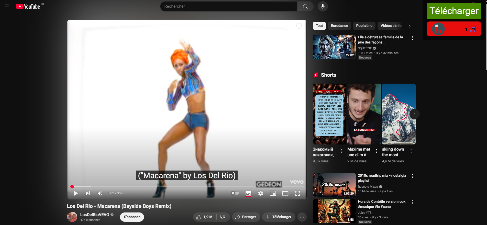
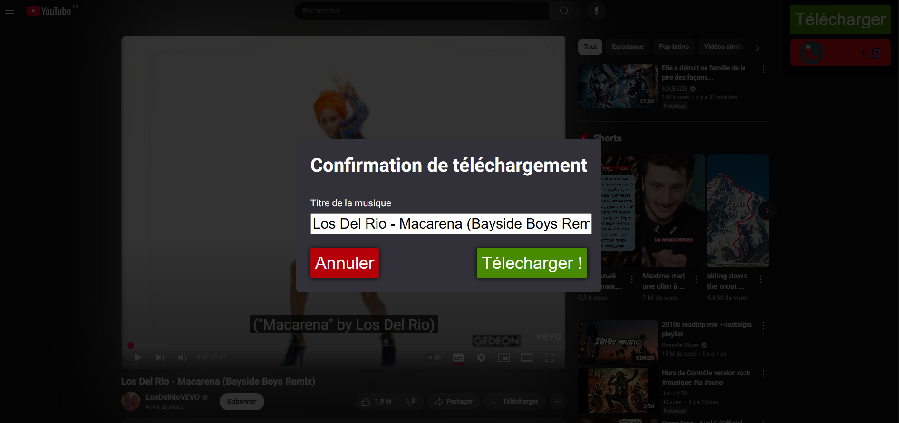

<h1>YouTube MP3 Chrome Extension</h1>

<h2>Description</h2>

Extension Google Chrome pour faciliter le transfert de fichiers MP3 issus de YouTube sur une clé USB.

<h2>Installation</h2>
<ul>
  <li>Cloner le dépôt.</li>
  <li>Installer les dépendances à l'aide du fichier "requirements.txt".</li>
  <li>Lancer le fichier Python "server/server.py" (lance un serveur Flask local).</li>
  <li>Aller sur Google Chrome > "chrome://extensions/" > Activer le mode développeur > Charger l'extension non empaquetée > Sélectionner le dossier du projet.</li>
</ul>
